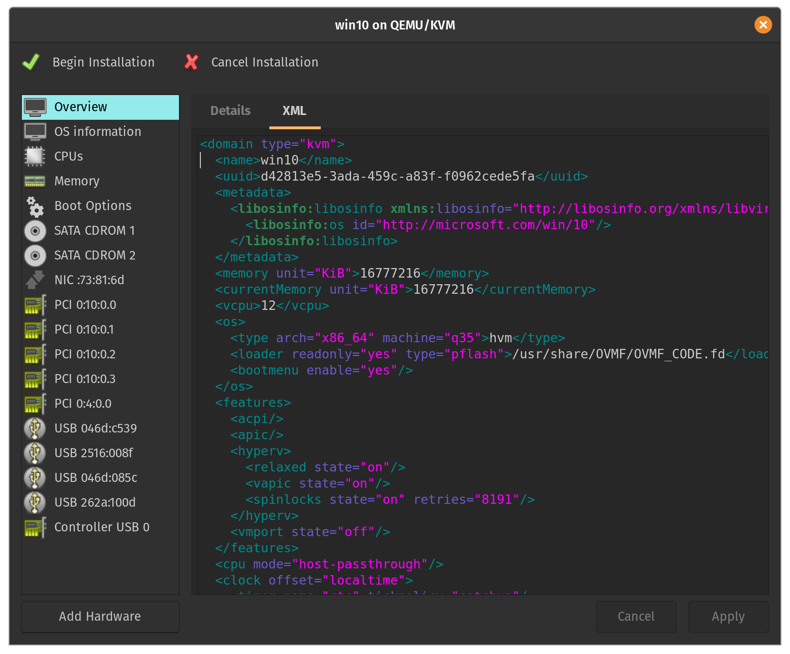
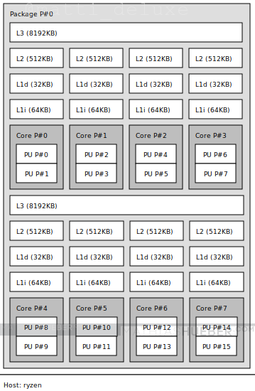

<h2>
    Table of Contents
</h2>

* [Introduction](#introduction)
    * [Considerations](#considerations)
    * [Hardware Requirements](#hardware_requirements)
    * [Hardware Setup](#hardware_setup)
* [Tutorial](#tutorial)
    * [Part 1: Preqrequisites](#part1)
    * [Part 2: VM Logistics](#part2)
    * [Part 3: Creating the VM](#part3)
    * [Part 4: Improving VM Performance](#part4)
    * [Part 5: Benchmarks](#part5)
* [Credits & Resources](#credits)
* [Footnotes](#footnotes)

<h2 name="introduction">
    Introduction
</h2>

In this post, I will be giving detailed instructions on how to run a KVM setup with GPU-passthrough. This setup uses a Linux host installed with [Pop!\_OS 19.10](https://system76.com/pop) and a guest VM running Windows 10. I am also running Linux kernel version 5.4.0.

<div align="center">
    
    <p>
        Source: <a href="https://events.static.linuxfound.org/sites/events/files/slides/KVM,%20OpenStack,%20and%20the%20Open%20Cloud%20-%20ANJ%20MK%20%20-%2013Oct14.pdf">Open Virtualization Alliance (Jollans, IBM , Kadera, Intel)</a>
    </p>
</div>

<h3 name="considerations">
    Considerations
</h3>

The main reason I wanted to get this setup working was because I found myself tired of using a dual-boot setup. I wanted to launch a Windows VM specifically for gaming while still be able to use my Linux host for development work.

At this point, you might be wondering... Why not just game on Linux? This is definitely an option for many people, but not one that suited my particular needs. Gaming on Linux requires the use of tools like [Wine](https://en.wikipedia.org/wiki/Wine_(software)) which act as a compatabilty layer for translating Windows system calls to Linux system calls. On the other hand, a GPU-passthrough setup utilizes [KVM](https://en.wikipedia.org/wiki/Kernel-based_Virtual_Machine) as a hypervisor to launch individual VMs with specific hardware attached to them. Performance wise, there are pros and cons to each approach.<span name="return1"><sup>[1](#footnote1)</sup></span>

For this tutorial, I will be using a GPU-passthrough setup. Specifically, I will be passing through an NVIDIA GPU to my guest VM while using an AMD GPU for my host. You could easily substitute an iGPU for the host but I chose to use a dGPU for performance reasons.<span name="return2"><sup>[2](#footnote2)</sup></span>

<h3 name="hardware_requirements"> Hardware Requirements </h3>

You're going to need the following to achieve a high-performance VM:
- Two graphics cards.
- [Hardware that supports IOMMU](https://en.wikipedia.org/wiki/List_of_IOMMU-supporting_hardware).
- A monitor with two inputs<span name="return3"><sup>[3](#footnote3)</sup></span> *or* multiple monitors.

<h3 name="hardware_setup">
    Hardware Setup
</h3>

- CPU:
    - AMD Ryzen 9 3900X
- Motherboard:
    - Gigabyte X570 Aorus Pro Wifi
- GPUs:
    - NVIDIA RTX 2080 Ti
    - AMD RX 5700
- Memory:
    - Corsair Vengeance LPX DDR4 3200 MHz 32GB (2x16)
- Disk:
    - Samsung 970 EVO Plus SSD 500GB - M.2 NVMe (host)
    - Samsung 970 EVO Plus SSD 1TB - M.2 NVMe (guest)

<h2 name="tutorial">
    Tutorial
</h2>

<h3 name="part1">
    Part 1: Prerequisites
</h3>

Before we begin, let's install some necessary packages:

```
$ sudo apt install libvirt-daemon-system libvirt-clients qemu-kvm qemu-utils virt-manager ovmf
```

Restart your machine and boot into BIOS. Enable a feature called `IOMMU`. You'll also need to enable CPU virtualization. For Intel processors, look for something called `VT-d`. For AMD, look for something called `AMD-Vi`. My motherboard is unique so I had to enable a feature called `SVM Mode`. Save any changes and restart the machine.

Once you've booted into the host, make sure that IOMMU is enabled:
`$ dmesg | grep IOMMU`

Also check that CPU virtualization is enabled:<br><br>
&nbsp;&nbsp;&nbsp;&nbsp;&nbsp;&nbsp; For Intel: `$ dmesg | grep VT-d` <br>
&nbsp;&nbsp;&nbsp;&nbsp;&nbsp;&nbsp; For AMD: `$ dmesg | grep AMD-Vi`

Now you're going to need to pass the hardware-enabled IOMMU functionality into the kernel as a [kernel parameter](https://wiki.archlinux.org/index.php/kernel_parameters). For our purposes, it makes the most sense to enable this feature at boot-time. Depending on your boot-loader (i.e. grub, systemd, rEFInd), you'll have to modify a specific configuration file. Since my machine uses systemd and these configuration files are often overwritten on updates, I will be using a tool called [kernelstub](https://github.com/pop-os/kernelstub):

&nbsp;&nbsp;&nbsp;&nbsp;&nbsp;&nbsp; For Intel: `$ sudo kernelstub --add-options "intel_iommu=on"`<br/>
&nbsp;&nbsp;&nbsp;&nbsp;&nbsp;&nbsp; For AMD: `$ sudo kernelstub --add-options "amd_iommu=on"`

When planning my GPU-passthrough setup, I discovered that many tutorials at this point will go ahead and have you blacklist the nvidia/amd drivers. The logic stems from the fact that since the native drivers can't attach to the GPU at boot-time, the GPU will be freed-up and available to bind to the vfio drivers instead. Most tutorials will have you add a kernel parameter called `pci-stub` with the ID of your GPU to achieve this. I found that this solution wasn't suitable for me. I prefer to dynamically unbind the nvidia/amd drivers and bind the vfio drivers right before the VM starts and subsequently reversing these actions when the VM stops ([see Part 2](#part2). That way, whenever the VM isn't in use, the GPU is available to the host machine on its native drivers.<span name="return4"><sup>[4](#footnote4)</sup></span>

Next, we need to determine the IOMMU groups of the graphics card we want to pass through to the VM. We'll want to make sure that our system has an appropriate IOMMU grouping scheme. Essentially, we need to remember that devices residing within the same IOMMU group need to be passed through to the VM (they can't be separated). To determine your IOMMU grouping, use the following script:

`iommu.sh`:
```
#!/bin/bash
for d in /sys/kernel/iommu_groups/*/devices/*; do
  n=${d#*/iommu_groups/*}; n=${n%%/*}
  printf 'IOMMU Group %s ' "$n"
  lspci -nns "${d##*/}"
done
```

For Intel systems, here's some sample output:
```
...
IOMMU Group 1 00:01.0 PCI bridge [0604]: Intel Corporation Xeon E3-1200 v5/E3-1500 v5/6th Gen Core Processor PCIe Controller (x16) [8086:1901] (rev 07)
IOMMU Group 1 00:01.1 PCI bridge [0604]: Intel Corporation Xeon E3-1200 v5/E3-1500 v5/6th Gen Core Processor PCIe Controller (x8) [8086:1905] (rev 07)
IOMMU Group 1 01:00.0 VGA compatible controller [0300]: NVIDIA Corporation TU102 [GeForce RTX 2080 Ti Rev. A] [10de:1e07] (rev a1)
IOMMU Group 1 01:00.1 Audio device [0403]: NVIDIA Corporation TU102 High Definition Audio Controller [10de:10f7] (rev a1)
IOMMU Group 1 01:00.2 USB controller [0c03]: NVIDIA Corporation TU102 USB 3.1 Controller [10de:1ad6] (rev a1)
IOMMU Group 1 01:00.3 Serial bus controller [0c80]: NVIDIA Corporation TU102 UCSI Controller [10de:1ad7] (rev a1)
IOMMU Group 1 02:00.0 VGA compatible controller [0300]: Advanced Micro Devices, Inc. [AMD/ATI] Ellesmere [Radeon RX 470/480/570/570X/580/580X/590] [1002:67df] (rev e1)
IOMMU Group 1 02:00.1 Audio device [0403]: Advanced Micro Devices, Inc. [AMD/ATI] Ellesmere HDMI Audio [Radeon RX 470/480 / 570/580/590] [1002:aaf0]
...
```

Here we see that both the NVIDIA and AMD GPUs reside in IOMMU group 1. This presents a problem. If you want to use the AMD GPU for the host machine while passing through the NVIDIA GPU to the guest VM, you need to figure out a way to separate their IOMMU groups.

1. One possible solution is to switch the PCI slot to which the AMD graphics card is attached. This may or may not produce the desired solution.
2. An alternative solution is something called the [ACS Override Patch](https://queuecumber.gitlab.io/linux-acs-override/). For an in-depth discussion, it's definitely worth checking out this post from [Alex Williamson](https://vfio.blogspot.com/2014/08/iommu-groups-inside-and-out.html). Make sure to consider the risks.<span name="return5"><sup>[5](#footnote5)</sup></span>

For my system, I was lucky<span name="return6"><sup>[6](#footnote6)</sup></span> because the NVIDIA and AMD GPUs resided in different IOMMU groups:

```
...
IOMMU Group 28 0a:00.0 VGA compatible controller [0300]: NVIDIA Corporation TU102 [GeForce RTX 2080 Ti Rev. A] [10de:1e07] (rev a1)
IOMMU Group 28 0a:00.1 Audio device [0403]: NVIDIA Corporation TU102 High Definition Audio Controller [10de:10f7] (rev a1)
IOMMU Group 28 0a:00.2 USB controller [0c03]: NVIDIA Corporation TU102 USB 3.1 Controller [10de:1ad6] (rev a1)
IOMMU Group 28 0a:00.3 Serial bus controller [0c80]: NVIDIA Corporation TU102 UCSI Controller [10de:1ad7] (rev a1)
...
IOMMU Group 31 0d:00.0 VGA compatible controller [0300]: Advanced Micro Devices, Inc. [AMD/ATI] Navi 10 [1002:731f] (rev c4)
IOMMU Group 32 0d:00.1 Audio device [0403]: Advanced Micro Devices, Inc. [AMD/ATI] Navi 10 HDMI Audio [1002:ab38]
...
```

If your setup is like mine<span name="return7"><sup>[7](#footnote7)</sup></span> and you had isolated IOMMU groups, feel free to skip the following section. Otherwise, please continue reading...

<h4 name="part 1.1">
    ACS Override Patch (Optional):
</h4>

For most linux distributions, the ACS Override Patch requires you to download the kernel source code, manually insert the ACS patch, compile + install the kernel, and then boot directly from the newly patched kernel.<span name="return8"><sup>[8](#footnote8)</sup></span>

Since I'm running a Debian-based distribution, I can use one of the [pre-compiled kernels](https://queuecumber.gitlab.io/linux-acs-override/) with the ACS patch already applied. After extracting the package contents, install the kernel and headers:

```
$ sudo dpkg -i linux-headers-5.3.0-acso_5.3.0-acso-1_amd64.deb
$ sudo dpkg -i linux-image-5.3.0-acso_5.3.0-acso-1_amd64.deb
$ sudo dpkg -i linux-libc-dev_5.3.0-acso-1_amd64.deb
```

Navigate to /boot and verify that you see the new initrd.img and vmlinuz:

```
$ ls
config-5.3.0-7625-generic    initrd.img-5.3.0-7625-generic  vmlinuz
config-5.3.0-acso            initrd.img-5.3.0-acso          vmlinuz-5.3.0-7625-generic
efi                          initrd.img.old                 vmlinuz-5.3.0-acso
initrd.img                   System.map-5.3.0-7625-generic  vmlinuz.old
initrd.img-5.3.0-24-generic  System.map-5.3.0-acso
```

We still have to copy the current kernel and initramfs image onto the ESP so that they are automatically loaded by EFI. We check the current configuration with [kernelstub](https://github.com/pop-os/kernelstub):

```
$ sudo kernelstub --print-config
kernelstub.Config    : INFO     Looking for configuration...
kernelstub           : INFO     System information:

    OS:..................Pop!_OS 19.10
    Root partition:....../dev/dm-1
    Root FS UUID:........2105a9ac-da30-41ba-87a9-75437bae74c6
    ESP Path:............/boot/efi
    ESP Partition:......./dev/nvme0n1p1
    ESP Partition #:.....1alt="virtman_3"
    NVRAM entry #:.......-1
    Boot Variable #:.....0000
    Kernel Boot Options:.quiet loglevel=0 systemd.show_status=false splash amd_iommu=on
    Kernel Image Path:.../boot/vmlinuz
    Initrd Image Path:.../boot/initrd.img
    Force-overwrite:.....False

kernelstub           : INFO     Configuration details:

   ESP Location:................../boot/efi
   Management Mode:...............True
   Install Loader configuration:..True
   Configuration version:.........3
```

You can see that the "Kernel Image Path" and the "Initrd Image Path" are symbolic links that point to the old kernel and initrd.

```
$ ls -l /boot
total 235488
-rw-r--r-- 1 root root   235833 Dec 19 11:56 config-5.3.0-7625-generic
-rw-r--r-- 1 root root   234967 Sep 16 04:31 config-5.3.0-acso
drwx------ 6 root root     4096 Dec 31  1969 efi
lrwxrwxrwx 1 root root       29 Dec 20 11:28 initrd.img -> initrd.img-5.3.0-7625-generic
-rw-r--r-- 1 root root 21197115 Dec 20 11:54 initrd.img-5.3.0-24-generic
-rw-r--r-- 1 root root 95775016 Jan 17 00:33 initrd.img-5.3.0-7625-generic
-rw-r--r-- 1 root root 94051072 Jan 18 19:57 initrd.img-5.3.0-acso
lrwxrwxrwx 1 root root       29 Dec 20 11:28 initrd.img.old -> initrd.img-5.3.0-7625-generic
-rw------- 1 root root  4707483 Dec 19 11:56 System.map-5.3.0-7625-generic
-rw-r--r-- 1 root root  4458808 Sep 16 04:31 System.map-5.3.0-acso
lrwxrwxrwx 1 root root       26 Dec 20 11:28 vmlinuz -> vmlinuz-5.3.0-7625-generic
-rw------- 1 root root 11398016 Dec 19 11:56 vmlinuz-5.3.0-7625-generic
-rw-r--r-- 1 root root  9054592 Sep 16 04:31 vmlinuz-5.3.0-acso
lrwxrwxrwx 1 root root       26 Dec 20 11:28 vmlinuz.old -> vmlinuz-5.3.0-7625-generic
```

Let's change that:

```
$ sudo rm /boot/vmlinuz
$ sudo ln -s /boot/vmlinuz-5.3.0-acso /boot/vmlinuz
$ sudo rm /boot/initrd.img
$ sudo ln -s /boot/initrd.img-5.3.0-acso /boot/initrd.img
```

Verify that the symbolic links now point to the correct kernel and initrd images:

```
$ ls -l /boot
total 235488
-rw-r--r-- 1 root root   235833 Dec 19 11:56 config-5.3.0-7625-generic
-rw-r--r-- 1 root root   234967 Sep 16 04:31 config-5.3.0-acso
drwx------ 6 root root     4096 Dec 31  1969 efi
lrwxrwxrwx 1 root root       27 Jan 18 20:02 initrd.img -> /boot/initrd.img-5.3.0-acso
-rw-r--r-- 1 root root 21197115 Dec 20 11:54 initrd.img-5.3.0-24-generic
-rw-r--r-- 1 root root 95775016 Jan 17 00:33 initrd.img-5.3.0-7625-generic
-rw-r--r-- 1 root root 94051072 Jan 18 19:57 initrd.img-5.3.0-acso
lrwxrwxrwx 1 root root       29 Dec 20 11:28 initrd.img.old -> initrd.img-5.3.0-7625-generic
-rw------- 1 root root  4707483 Dec 19 11:56 System.map-5.3.0-7625-generic
-rw-r--r-- 1 root root  4458808 Sep 16 04:31 System.map-5.3.0-acso
lrwxrwxrwx 1 root root       24 Jan 18 20:02 vmlinuz -> /boot/vmlinuz-5.3.0-acso
-rw------- 1 root root 11398016 Dec 19 11:56 vmlinuz-5.3.0-7625-generic
-rw-r--r-- 1 root root  9054592 Sep 16 04:31 vmlinuz-5.3.0-acso
lrwxrwxrwx 1 root root       26 Dec 20 11:28 vmlinuz.old -> vmlinuz-5.3.0-7625-generic
```

Finally, add the ACS Override Patch to your list of kernel parameter options:

```
$ sudo kernelstub --add-options "pcie_acs_override=downstream"
```

Reboot and verify that the IOMMU groups for your graphics cards are different:

```
...
IOMMU Group 15 01:00.0 VGA compatible controller [0300]: NVIDIA Corporation TU102 [GeForce RTX 2080 Ti Rev. A] [10de:1e07] (rev a1)
IOMMU Group 15 01:00.1 Audio device [0403]: NVIDIA Corporation TU102 High Definition Audio Controller [10de:10f7] (rev a1)
IOMMU Group 15 01:00.2 USB controller [0c03]: NVIDIA Corporation TU102 USB 3.1 Controller [10de:1ad6] (rev a1)
IOMMU Group 15 01:00.3 Serial bus controller [0c80]: NVIDIA Corporation TU102 UCSI Controller [10de:1ad7] (rev a1)
IOMMU Group 16 02:00.0 VGA compatible controller [0300]: Advanced Micro Devices, Inc. [AMD/ATI] Ellesmere [Radeon RX 470/480/570/570X/580/580X/590] [1002:67df] (rev e1)
IOMMU Group 16 02:00.1 Audio device [0403]: Advanced Micro Devices, Inc. [AMD/ATI] Ellesmere HDMI Audio [Radeon RX 470/480 / 570/580/590] [1002:aaf0]
...
```

<h4 name="part1.2">
    Download ISO files (Mandatory):
</h4>

Since we're building a Windows VM, we're going to need to download and use the virtIO drivers. [virtIO](https://www.linux-kvm.org/page/Virtio) is a virtualization standard for network and disk device drivers. Adding the virtIO drivers can be done by attaching its relevant ISO to the Windows VM during creation. Fedora provides the virtIO drivers for [direct download](https://docs.fedoraproject.org/en-US/quick-docs/creating-windows-virtual-machines-using-virtio-drivers/#virtio-win-direct-downloads).

Since I am passing through an entire NVMe SSD (1 TB), I won't need to install any 3rd party drivers on top of the virtIO driver. Passing through the SSD as a PCI device lets Windows deal with it as a native NVMe device and therefore *should* offer better performance. If you choose to use a raw disk image instead, things are going to be a little different... Make sure to follow the instructions in [this guide](https://frdmtoplay.com/virtualizing-windows-7-or-linux-on-a-nvme-drive-with-vfio/#builddriveriso). The guide will show you how to add 3rd party drivers on top of the existing virtIO drivers by rebuilding the ISO.

For the final step, we're going to need to download the Windows 10 ISO from Microsoft which you can find [here](https://www.microsoft.com/en-us/software-download/windows10ISO).

<h3 name="part2">
    Part 2: VM Logistics
</h3>

As mentioned earlier, we are going to dynamically bind the vfio drivers before the VM starts and unbind these drivers after the VM terminates. To achieve this, we're going to use [libvirt hooks](https://libvirt.org/hooks.html). Libvirt has a hook system that allows you to run commands on startup or shutdown of a VM. All relevant scripts are located within the following directory: `/etc/libvirt/hooks`. If the directory doesn't exist, go ahead and create it. Lucky for us, The Passthrough POST has a [hook helper tool](https://passthroughpo.st/simple-per-vm-libvirt-hooks-with-the-vfio-tools-hook-helper/) to make our lives easier. Run the following commands to install the hook manager and make it executable:

```
$ sudo wget 'https://raw.githubusercontent.com/PassthroughPOST/VFIO-Tools/master/libvirt_hooks/qemu' \
     -O /etc/libvirt/hooks/qemu
$ sudo chmod +x /etc/libvirt/hooks/qemu
```

Go ahead and restart libvirt to use the newly installed hook helper:

```
$ sudo service libvirtd restart
```

Let's look at the most important hooks:

```
# Before a VM is started, before resources are allocated:
/etc/libvirt/hooks/qemu.d/$vmname/prepare/begin/*

# Before a VM is started, after resources are allocated:
/etc/libvirt/hooks/qemu.d/$vmname/start/begin/*

# After a VM has started up:
/etc/libvirt/hooks/qemu.d/$vmname/started/begin/*

# After a VM has shut down, before releasing its resources:
/etc/libvirt/hooks/qemu.d/$vmname/stopped/end/*

# After a VM has shut down, after resources are released:
/etc/libvirt/hooks/qemu.d/$vmname/release/end/*
```

If we place an executable script in one of these directories, the hook manager will take care of everything else. I've chosen to name my VM "win10" so I set up my directory structure like this:

```
$ tree /etc/libvirt/hooks/
/etc/libvirt/hooks/
├── qemu
└── qemu.d
    └── win10
        ├── prepare
        │   └── begin
        └── release
            └── end
```

It's time to get our hands dirty... Create a file named `kvm.conf` and place it under `/etc/libvirt/hooks/`. Add the following entries to the file:

```
## Virsh devices
VIRSH_GPU_VIDEO=pci_0000_0a_00_0
VIRSH_GPU_AUDIO=pci_0000_0a_00_1
VIRSH_GPU_USB=pci_0000_0a_00_2
VIRSH_GPU_SERIAL=pci_0000_0a_00_3
VIRSH_NVME_SSD=pci_0000_04_00_0
```

Make sure to substitute the correct bus addresses for the devices you'd like to passthrough to your VM (in my case a GPU and SSD). Now create two executable bash scripts:

`bind_vfio.sh`:
```
#!/bin/bash

## Load the config file
source "/etc/libvirt/hooks/kvm.conf"

## Unload nvidia
modprobe -r nvidia_drm
modprobe -r nvidia_uvm
modprobe -r nvidia_modeset

## Load vfio
modprobe vfio
modprobe vfio_iommu_type1
modprobe vfio_pci

## Unbind gpu from nvidia and bind to vfio
virsh nodedev-detach $VIRSH_GPU_VIDEO
virsh nodedev-detach $VIRSH_GPU_AUDIO
virsh nodedev-detach $VIRSH_GPU_USB
virsh nodedev-detach $VIRSH_GPU_SERIAL
## Unbind ssd from nvme and bind to vfio
virsh nodedev-detach $VIRSH_NVME_SSD
```

`unbind_vfio.sh`:
```
#!/bin/bash

## Load the config file
source "/etc/libvirt/hooks/kvm.conf"

## Unbind gpu from vfio and bind to nvidia
virsh nodedev-reattach $VIRSH_GPU_VIDEO
virsh nodedev-reattach $VIRSH_GPU_AUDIO
virsh nodedev-reattach $VIRSH_GPU_USB
virsh nodedev-reattach $VIRSH_GPU_SERIAL
## Unbind ssd from vfio and bind to nvme
virsh nodedev-reattach $VIRSH_NVME_SSD

## Unload vfio
modprobe -r vfio_pci
modprobe -r vfio_iommu_type1
modprobe -r vfio

## Load nvidia
modprobe nvidia_modeset
modprobe nvidia_uvm
modprobe nvidia_drm
```

Place these scripts so that your directory structure looks like this:
```
$ tree /etc/libvirt/hooks/
/etc/libvirt/hooks/
├── kvm.conf
├── qemu
└── qemu.d
    └── win10
        ├── prepare
        │   └── begin
        │       └── bind_vfio.sh
        └── release
            └── end
                └── unbind_vfio.sh
```

We've succesfully created libvirt hook scripts to dynamically bind the vfio drivers before the VM starts and unbind these drivers after the VM terminates. At the moment, we're done messing around with libvirt hooks. We'll revisit this topic later on when we make performance tweaks to our VM ([see Part 4](#part4)).

<h3 name="part3">
    Part 3: Creating the VM
</h3>

We're ready to begin creating our VM. There are basically two options for how to achieve this: **(1)** If you prefer a GUI approach, then follow the rest of this tutorial. **(2)** If you prefer bash scripts, take a look at YuriAlek's series of [GPU-passthrough scripts](https://gitlab.com/YuriAlek/vfio) and customize them to fit your needs. The main difference between these two methods lies with the fact that the scripting approach uses [bare QEMU](https://www.mankier.com/1/qemu) commands<span name="return9"><sup>[9](#footnote9)</sup></span>, while the GUI approach uses [virt-manager](https://virt-manager.org/). Virt-manager essentially builds on-top of the QEMU base-layer and adds other features/complexity.<span name="return10"><sup>[10](#footnote10)</sup></span>

Go ahead and start virt-manager from your list of applications. Select the button on the top left of the GUI to create a new VM:

<div align="center">
    
</div><br>

Select the "Local install media" option. My ISOs are stored in my home directory `/home/user/.iso`, so I'll create a new pool and select the Windows 10 ISO from there:

<div align="center">
    
</div><br>

Configure some custom RAM and CPU settings for your VM:

<div align="center">
    
</div><br>

Next, the GUI asks us whether we want to enable storage for the VM. As already mentioned, my setup will be using SSD passthrough so I chose not to enable storage. You also have the option to create a raw disk image:

<div align="center">
    
</div><br>

On the last step, review your settings and select a name for your VM. Make sure to select the checkbox "Customize configuration before installation" and click Finish:

<div align="center">
    
</div><br>

A new window should appear with more advanced configuration options. You can alter these options through the GUI or the associated libvirt XML settings. Make sure that on the Overview page under Firmware you select `UEFI x86_64: /usr/share/OVMF/OVMF_CODE.fd`:

<div align="center">
    
</div><br>

Go to the CPUs page and remove the check next to `Copy host CPU configuration` and under Model type `host-passthrough`. Also make sure to check the option for `Enable available CPU security flaw mitigations` to prevent against Spectre/Meltdown vulnerabilities.

<div align="center">
    
</div><br>

I've chosen to remove several of the menu options that won't be useful to my setup (feel free to keep them if you'd like):

<div align="center">
    
</div><br>

Let's add the virtIO drivers. Click 'Add Hardware' and under 'Storage', create a custom storage device of type `CDROM`. Make sure to locate the ISO image for the virtIO drivers from earlier:

<div align="center">
    
</div><br>

Under the NIC menu, change the device model to `virtIO` for improved performance:

<div align="center">
    
</div><br>

Now it's time to configure our passthrough devices! Click 'Add Hardware' and under 'PCI Host Device', select the Bus IDs corresponding to your GPU.

<div align="center">
    
</div><br>

Make sure to repeat this step for all the devices associated with your GPU in the same IOMMU group (usually VGA, audio controller, etc.):

<div align="center">
    
</div><br>

Since I'm passing through an entire disk to my VM, I selected the Bus ID corresponding to the 1TB Samsung NVMe SSD which has Windows 10 (and my games) installed on it.

<div align="center">
    
</div><br>

Then under the 'Boot Options' menu, I added a check next to `Enable boot menu` and reorganized the devices so that I could boot directly from the 1TB SSD:

<div align="center">
    
</div><br>

You can now go ahead and select the USB Host Devices you'd like to passthrough to your guest VM (usually a keyboard, mouse, etc.). Please note that these devices will be held by the guest VM from the moment it's created until its stopped and will be unavailable to the host.<span name="return11"><sup>[11](#footnote11)</sup></span>

<div align="center">
    
</div><br>

Unfortunately, not everything we need can be accomplished within the virt-manager GUI. For the rest of this section, we'll have to do some fine-tuning by directly editing the XML:

<div align="center">
    
</div><br>

If you're like me and you're passing through an NVIDIA GPU to your VM, then you might run into the following common roadblock. [Error 43](https://passthroughpo.st/apply-error-43-workaround/) occurs because NVIDIA intentionally disables virtualization features on its GeForce line of cards. The way to deal with this is to have the hypervisor hide its existence. Inside the `hyperv` section, add a tag for `vendor_id` such that `state="on"` and `value` is any string up to 12 characters long:

```
<features>
    ...
    <hyperv>
        <relaxed state="on"/>
        <vapic state="on"/>
        <spinlocks state="on" retries="8191"/>
        <vendor_id state="on" value="kvm hyperv"/>
    </hyperv>
    ...
</features>
```

In addition, instruct the kvm to hide its state by adding the following code directly below the `hyperv` section:

```
<features>
    ...
    <hyperv>
        ...
    </hyperv>
    <kvm>
      <hidden state="on"/>
    </kvm>
    ...
</features>
```

Finally, if you're using QEMU 4.0 with the q35 chipset you also need to add the following code at the end of `<features>`:

```
<features>
    ...
    <ioapic driver="kvm"/>
</features>
```

Now you should have no issues with regards to the NVIDIA Error 43. Later on, we will be making more changes to the XML to achieve better performance (see Part 4). At this point however, you can apply the changes and select "Begin Installation" at the top left of the GUI. Please be aware that this may take several minutes to complete.

<h3 name="part4">
    Part 4: Improving VM Performance
</h3>

None of the following performance optimizations are necessary to get a working GPU passthrough system. However, these tweaks will make a difference if you're at all concerned about reaching buttery-smooth gaming performance. Though some of these changes are more difficult than others, I highly advise you to at least consider them.

<h4>
    Hugepages
</h4>

Memory (RAM) is divided up into basic segments called *pages*. By default, the x86 architecture has a page size of 4KB. CPUs utilize pages within a built in memory management unit (MMU). Although the standard page size is suitable for many tasks, *hugepages* are a mechanism that allow the Linux kernel to take advantage of large amounts of memory with reduced overhead. Hugepages can vary in size anywhere from 2MB to 1GB. Hugepages are enabled by default but if they aren't, make sure to download the package: `$ sudo apt install hugepages`.<span name="return12"><sup>[12](#footnote12)</sup></span>

Go back to your VM's XML settings by either using the virt-man GUI or the command: `$ sudo virsh edit {vm-name}`. Insert the `memoryBacking` lines so that your configuration looks like this:

```
<memory unit="KiB">16777216</memory>
<currentMemory unit="KiB">16777216</currentMemory>
<memoryBacking>
    <hugepages/>
</memoryBacking>
```

Many tutorials will have you reserve hugepages for your guest VM at host boot-time. There's a significant downside to this approach: a portion of RAM will be unavailable to your host even when the VM is inactive. In my setup, I've chose to allocate hugepages before the VM starts and deallocate those pages on VM shutdown through the use of two additional executable scripts<span name="return13"><sup>[13](#footnote13)</sup></span> inside libvirt hooks ([see Part 2](#part2)):

```
$ tree /etc/libvirt/hooks/
/etc/libvirt/hooks/
├── kvm.conf
├── qemu
└── qemu.d
    └── win10
        ├── prepare
        │   └── begin
        │       ├── ...
        │       └── alloc_hugepages.sh
        └── release
            └── end
                ├── ...
                └── dealloc_hugepages.sh
```

`alloc_hugepages.sh`:
```
#!/bin/bash

## Load the config file
source "/etc/libvirt/hooks/kvm.conf"

## Calculate number of hugepages to allocate from memory (in MB)
HUGEPAGES="$(($MEMORY/$(($(grep Hugepagesize /proc/meminfo | awk '{print $2}')/1024))))"

echo "Allocating hugepages..."
echo $HUGEPAGES > /proc/sys/vm/nr_hugepages
ALLOC_PAGES=$(cat /proc/sys/vm/nr_hugepages)

TRIES=0
while (( $ALLOC_PAGES != $HUGEPAGES && $TRIES < 1000 ))
do
    echo 1 > /proc/sys/vm/compact_memory            ## defrag ram
    echo $HUGEPAGES > /proc/sys/vm/nr_hugepages
    ALLOC_PAGES=$(cat /proc/sys/vm/nr_hugepages)
    echo "Succesfully allocated $ALLOC_PAGES / $HUGEPAGES"
    let TRIES+=1
done

if [ "$ALLOC_PAGES" -ne "$HUGEPAGES" ]
then
    echo "Not able to allocate all hugepages. Reverting..."
    echo 0 > /proc/sys/vm/nr_hugepages
    exit 1
fi

```

`dealloc_hugepages.sh`
```
#!/bin/bash

## Load the config file
source "/etc/libvirt/hooks/kvm.conf"

echo 0 > /proc/sys/vm/nr_hugepages
```

<h4>
    CPU Governor Settings
</h4>

This performance tweak<span name="return14"><sup>[14](#footnote14)</sup></span> takes advantage of the [CPU scaling governor](https://wiki.archlinux.org/index.php/CPU_frequency_scaling) in Linux. It's a feature that is often ofterlooked in many passthrough tutorials, but we include it here because its recommended. Once again, we'll be utilizing libvirt's hook system ([see Part 2](#part2)):

```
$ tree /etc/libvirt/hooks/
/etc/libvirt/hooks/
├── kvm.conf
├── qemu
└── qemu.d
    └── win10
        ├── prepare
        │   └── begin
        │       ├── ...
        │       └── cpu_mode_performance.sh
        └── release
            └── end
                ├── ...
                └── cpu_mode_ondemand.sh
```

`cpu_mode_performance.sh`:
```
#!/bin/bash

## Load the config file
source "/etc/libvirt/hooks/kvm.conf"

## Enable CPU governor performance mode
cat /sys/devices/system/cpu/cpu*/cpufreq/scaling_governor
for file in /sys/devices/system/cpu/cpu*/cpufreq/scaling_governor; do echo "performance" > $file; done
cat /sys/devices/system/cpu/cpu*/cpufreq/scaling_governor

```

`cpu_mode_ondemand.sh`:
```
#!/bin/bash

## Load the config file
source "/etc/libvirt/hooks/kvm.conf"

## Enable CPU governor on-demand mode
cat /sys/devices/system/cpu/cpu*/cpufreq/scaling_governor
for file in /sys/devices/system/cpu/cpu*/cpufreq/scaling_governor; do echo "ondemand" > $file; done
cat /sys/devices/system/cpu/cpu*/cpufreq/scaling_governor
```

<h4>
    CPU Pinning
</h4>

This performance tweak applies *only* to those of you whose processors are [multithreaded](https://en.wikipedia.org/wiki/Multithreading_(computer_architecture)). My setup has an AMD Ryzen 3900X which has 12 physical cores and 24 threads (logical cores).

VMs are unable to distinguish between these physical and logical cores. From the guest's perspective, virt-manager sees that there are 24 virtual CPUs (vcpu) available. From the host's perspective however, two virtual cores map to a physical core on the CPU die.

It's **very important** that when we passthrough a core, we include its sibling. To get a sense which cores are siblings just do `$ cat /proc/cpuinfo | grep "core id"`. A matching core id means the associated threads run in the same physical core.<span name="return15"><sup>[15](#footnote15)</sup></span>

If you're more of a visual learner, perhaps this diagram of an AMD Ryzen 1800X (8 cores, 16 threads) will help you visualize what's going on. I highly recommend you check out [Mathias Hauber's tutorial](https://mathiashueber.com/performance-tweaks-gaming-on-virtual-machines/) which is the source of this image:

<div align="center">
    
</div><br>

It's time to edit the XML configuration of our VM. I've added the following lines of code (custom for every processor):

```
<vcpu placement="static">12</vcpu>
<iothreads>5</iothreads>
<cputune>
    <vcpupin vcpu="0" cpuset="6"/>
    <vcpupin vcpu="1" cpuset="18"/>
    <vcpupin vcpu="2" cpuset="7"/>
    <vcpupin vcpu="3" cpuset="19"/>
    <vcpupin vcpu="4" cpuset="8"/>
    <vcpupin vcpu="5" cpuset="20"/>
    <vcpupin vcpu="6" cpuset="9"/>
    <vcpupin vcpu="7" cpuset="21"/>
    <vcpupin vcpu="8" cpuset="10"/>
    <vcpupin vcpu="9" cpuset="22"/>
    <vcpupin vcpu="10" cpuset="11"/>
    <vcpupin vcpu="11" cpuset="23"/>
    <emulatorpin cpuset="0-1"/>
    <iothreadpin iothread='1' cpuset='2-3'/>
    <iothreadpin iothread='2' cpuset='4-5'/>
    <iothreadpin iothread='3' cpuset='12-13'/>
    <iothreadpin iothread='4' cpuset='14-15'/>
    <iothreadpin iothread='5' cpuset='16-17'/>
</cputune>
```

In addition, edit `<cpu>` to define the CPU topography. In my case, my processor has 1 socket with 6 physical cores and 2 threads per core:

```
<cpu mode="host-passthrough" check="none">
  <topology sockets="1" cores="6" threads="2"/>
  <cache mode='passthrough'/>
  <feature policy='require' name='topoext'/>
</cpu>
```

<h4>
    Hyper-V Enlightenments
</h4>

Hyper-V enlightenments help the guest VM handle virtualization tasks. [Libvirt](https://libvirt.org/formatdomain.html#elementsFeatures) has a detailed breakdown of these features. I've chosen to go with the set of features recommended in [this tutorial](https://mathiashueber.com/performance-tweaks-gaming-on-virtual-machines/) due to hardware similarities:

```
<features>
    ...
    <hyperv>
      <relaxed state="on"/>
      <vapic state="on"/>
      <spinlocks state="on" retries="8191"/>
      <vendor_id state="on" value="kvm hyperv"/>
      <vpindex state='on'/>
      <synic state='on'/>
      <stimer state='on'/>
      <reset state='on'/>
      <frequencies state='on'/>
    </hyperv>
    ...
</features>
```

<h3 name="part5">
    Part 5: Benchmarks
</h3>

Congrats! You've finished setting up your Windows gaming VM! But now comes the most important part... Let's compare the bare-metal performance of Windows against our KVM. If everything goes according to plan, we can expect somewhat close to native performance on the VM. In order to test this theory, I used the following benchmark software: [UserBenchmark](https://www.userbenchmark.com/). Check out the results for yourself:<span name="return16"><sup>[16](#footnote16)</sup></span>

* [Windows Native](https://www.userbenchmark.com/UserRun/25008533)
* [Windows KVM](https://www.userbenchmark.com/UserRun/25008992)

Hopefully your results are as good as mine, if not better!

<h2 name="credits">
    Credits & Resources
</h2>

- Docs
    - Linux Kernel
        - [KVM](https://www.kernel.org/doc/html/latest/virt/kvm/index.html)
        - [VFIO](https://www.kernel.org/doc/html/latest/driver-api/vfio.html?highlight=vfio%20pci)
    - ArchWiki
        - [QEMU](https://wiki.archlinux.org/index.php/QEMU)
        - [KVM](https://wiki.archlinux.org/index.php/KVM)
        - [Libvirt](https://wiki.archlinux.org/index.php/Libvirt)
        - [PCI Passthrough](https://wiki.archlinux.org/index.php/PCI_passthrough_via_OVMF)
    - Libvirt Wiki
        - [virtIO](https://wiki.libvirt.org/page/Virtio)
        - [Hooks](https://libvirt.org/hooks.html)
        - [Domain XML](https://libvirt.org/formatdomain.html)
        - [QEMU Guest Agent](https://wiki.libvirt.org/page/Qemu_guest_agent)
- Tutorials
    - Heiko Sieger - [Running Windows 10 on Linux using KVM with VGA Passthrough](https://heiko-sieger.info/running-windows-10-on-linux-using-kvm-with-vga-passthrough)
    - Alex Williamson - VFIO GPU How To series
        - [Part 1 - The hardware](https://vfio.blogspot.com/2015/05/vfio-gpu-how-to-series-part-1-hardware.html)
        - [Part 2 - Expectations](https://vfio.blogspot.com/2015/05/vfio-gpu-how-to-series-part-2.html)
        - [Part 3 - Host configuration](https://vfio.blogspot.com/2015/05/vfio-gpu-how-to-series-part-3-host.html)
        - [Part 4 - Our first VM](https://vfio.blogspot.com/2015/05/vfio-gpu-how-to-series-part-4-our-first.html)
        - [Part 5 - A VGA-mode, SeaBIOS VM](https://vfio.blogspot.com/2015/05/vfio-gpu-how-to-series-part-5-vga-mode.html)
    - David Yates - [GPU passthrough: gaming on Windows on Linux](https://davidyat.es/2016/09/08/gpu-passthrough/)
    - Wendell - [VFIO in 2019 – Pop!_OS How-To](https://forum.level1techs.com/t/vfio-in-2019-pop-os-how-to-general-guide-though-draft/142287)
        - Wendell is from [Level1Techs](https://level1techs.com/). He has contributed to the FOSS community with a cool application called [Looking Glass](https://looking-glass.hostfission.com/). I recommend you check out this [video](https://www.youtube.com/watch?v=okMGtwfiXMo) for more information.
        - Wendell has even collaborated with Linus from [Linus Tech Tips](https://www.youtube.com/user/LinusTechTips) and put out [this video](https://www.youtube.com/watch?v=SsgI1mkx6iw).
    - Yuri Alek - [Single GPU passthrough](https://gitlab.com/YuriAlek/vfio)
    - Jack Ford - [Ubuntu 18.04 - KVM/QEMU Windows 10 GPU Passthrough](https://blog.zerosector.io/2018/07/28/kvm-qemu-windows-10-gpu-passthrough/)
    - Bsilvereagle - [Virtualizing Windows 7 (or Linux) on a NVMe drive with VFIO](https://frdmtoplay.com/virtualizing-windows-7-or-linux-on-a-nvme-drive-with-vfio/)
    - Mathias Hauber
        - [Windows virtual machine GPU passthrough Ubuntu](https://mathiashueber.com/windows-virtual-machine-gpu-passthrough-ubuntu/)
        - [Performance tweaks gaming on virtual machines](https://mathiashueber.com/performance-tweaks-gaming-on-virtual-machines/)
        - [Configuring Hugepages to use in a virtual machine](https://mathiashueber.com/configuring-hugepages-use-virtual-machine/)
        - [QEMU Troubleshooting errors-gpu-passthrough-vm](https://mathiashueber.com/qemu-troubleshooting-errors-gpu-passthrough-vm/)
    - Rokas Kupstys - [Performance of your gaming VM](https://rokups.github.io/#!pages/gaming-vm-performance.md)
- Videos
    - GrayWolfTech - [Play games in Windows on Linux! PCI passthrough quick guide](https://www.youtube.com/watch?v=dsDUtzMkxFk)
    - Raven Repair Co. - [How to create a KVM gaming virtual machine in under 30 minutes!](https://www.youtube.com/watch?v=HXgQVAl4JB4&list=PLoQO63DBLOOM1zf4Fm2HG3QhzlJK7PTAI)
    - Level1Linux - [GPU Passthrough for Virtualization with Ryzen: Now Working](https://www.youtube.com/watch?v=aLeWg11ZBn0&t=1595s)
- Blogs
    - The Passthrough Post
        - [VFIO PC Builds](https://passthroughpo.st/vfio-increments/)
        - [Howto: Libvirt Automation Using VFIO-Tools Hook Helper](https://passthroughpo.st/simple-per-vm-libvirt-hooks-with-the-vfio-tools-hook-helper/)
        - [How to Apply the Error 43 Workaround](https://passthroughpo.st/apply-error-43-workaround/)
    - Heiko Sieger
        - [Glossary of Virtualization Terms](https://heiko-sieger.info/glossary-of-virtualization-terms/)
        - [IOMMU Groups – What You Need to Consider](https://heiko-sieger.info/iommu-groups-what-you-need-to-consider/)
        - [Virtualization Hardware Accessories](https://heiko-sieger.info/virtualization-hardware-accessories/)
        - [Windows 10 Virtual Machine Benchmarks](https://heiko-sieger.info/windows-10-virtual-machine-benchmarks/)
        - [Windows 10 Benchmarks (Virtual Machine)](https://heiko-sieger.info/benchmarks/)
- Lectures
    - Alex Williamson - Red Hat
        - [An Introduction to PCI Device Assignment with VFIO](https://www.youtube.com/watch?v=WFkdTFTOTpA&feature=emb_title)
        - [VFIO Device Assignment Quirks, How to use Them and How to Avoid Them](https://www.youtube.com/watch?v=A9rV2_3yIOk&t=790s)
    - Martin Polednik - Red Hat
        - [Helping Users Maximize VM Performance](https://www.youtube.com/watch?v=_SlUlQRcnQg)
    - Neo Jia & Kirti Wankhede - NVIDIA
        - [vGPU on KVM - A VFIO Based Framework](https://www.youtube.com/watch?v=Xs0TJU_sIPc&t=164s)
- Communities
    - [Reddit /r/vfio](https://www.reddit.com/r/vfio)
    - [Level1Techs](https://forum.level1techs.com/)
    - [KVM Forum](https://www.youtube.com/channel/UCRCSQmAOh7yzgheq-emy1xA)

<h2 name="footnotes">
    Footnotes
</h2>

<ol>
    <li name="footnote1">
        Check out <a href="https://news.ycombinator.com/item?id=18328323">this thread</a> from Hacker News for more information.
        <a href="#return1"><sup>&#x21ba;</sup></a>
    </li>
    <li name="footnote2">
        I'll be using the term *iGPU* to refer to Intel's line of integrated GPUs that usually come built into their processors, and the term *dGPU* to refer to dedicated GPUs which are much better performance-wise and meant for gaming or video editing (NVIDIA/AMD).
        <a href="#return2"><sup>&#x21ba;</sup></a>
    </li>
    <li name="footnote3">
        Make sure that the monitor input used for your gaming VM supports FreeSync/G-Sync technology. In my case, I reserved the displayport 1.2 input for my gaming VM since G-Sync is not supported across HDMI (which was instead used for host graphics).
        <a href="#return3"><sup>&#x21ba;</sup></a>
    </li>
    <li name="footnote4">
        I specifically wanted my Linux host to be able to perform <a href="https://developer.nvidia.com/cuda-downloads">CUDA</a> work on the attached NVIDIA GPU. Just because my graphics card wasn't attached to a display didn't stop me from wanting to use <a href="https://developer.nvidia.com/cudnn">cuDNN</a> for ML/AI applications.
        <a href="#return4"><sup>&#x21ba;</sup></a>
    </li>
    <li name="footnote5">
        Applying the ACS Override Patch <b>may compromise system security</b>. Check out <a href="https://www.reddit.com/r/VFIO/comments/bvif8d/official_reason_why_acs_override_patch_is_not_in/">this post</a> to see why the ACS patch will probably never make its way upstream to the mainline kernel.
        <a href="#return5"><sup>&#x21ba;</sup></a>
    </li>
    <li name="footnote6">
        I'm actually being a bit disingenuous here... I deliberately purchased hardware that I knew would provide ACS implementation (and hence good IOMMU isolation). After flashing the most recent version of my motherboard's BIOS, I made sure to enable the following features under the "AMD CBS" menu: <code>ACS Enable</code>, <code>AER CAP</code>, <code>ARI Support</code>.
        <a href="#return6"><sup>&#x21ba;</sup></a>
    </li>
    <li name="footnote7">
        AMD CPUs/motherboards/chipsets tend to provide better ACS support than their Intel counterparts. The Intel Xeon family of processors is a notable exception. Xeon is mainly targeted at non-consumer workstations and thus are an excellent choice for PCI/VGA passthrough. Be aware that they do command a hefty price tag.
        <a href="#return7"><sup>&#x21ba;</sup></a>
    </li>
    <li name="footnote8">
        Credit to the solution presented in <a href="https://forum.level1techs.com/t/how-to-apply-acs-override-patch-kubuntu-18-10-kernel-4-18-16/134204">this post</a>.
        <a href="#return8"><sup>&#x21ba;</sup></a>
    </li>
    <li name="footnote9">
        If you decide to use bash scripts to launch your VM, I've included a file in the repository called <code>qemu.sh</code>. Make sure to fill out the <code>#TODO</code> section of the code with your custom version of the command <code>qemu-system-x86-64</code>.
        <a href="#return9"><sup>&#x21ba;</sup></a>
    </li>
    <li name="footnote10">
        See <a href="https://www.stratoscale.com/blog/compute/using-bare-qemu-kvm-vs-libvirt-virt-install-virt-manager/">this link</a> for more details and a comparison between QEMU and virt-manager.
        <a href="#return10"><sup>&#x21ba;</sup></a>
    </li>
    <li name="footnote11">
        See <a href="https://heiko-sieger.info/running-windows-10-on-linux-using-kvm-with-vga-passthrough/#About_keyboard_and_mouse">this link</a> for software/hardware solutions that share your keyboard and mouse across your host and guest.
        <a href="#return11"><sup>&#x21ba;</sup></a>
    </li>
    <li name="footnote12">
        For more information on hugepages, refer to <a href="https://help.ubuntu.com/community/KVM%20-%20Using%20Hugepages">this link.
        <a href="#return12"><sup>&#x21ba;</sup></a>
    </li>
    <li name="footnote13">
        Credit to the comment from /u/tholin in <a href="https://www.reddit.com/r/VFIO/comments/dmie86/setting_up_hugepages/">this post</a>.
        <a href="#return13"><sup>&#x21ba;</sup></a>
    </li>
    <li name="footnote14">
        Credit to Mathias Hueber in <a href="https://mathiashueber.com/performance-tweaks-gaming-on-virtual-machines/">this post</a>.
        <a href="#return14"><sup>&#x21ba;</sup></a>
    </li>
    <li name="footnote15">
        Credit to Rokas Kupstys in <a href="https://rokups.github.io/#!pages/gaming-vm-performance.md">this post.
        <a href="#return15"><sup>&#x21ba;</sup></a>
    </li>
    <li name="footnote16">
        In order to keep things fair and equal, I chose to passthrough all 12-cores/24 threads to the KVM. That way, the bare-metal installation won't have an unfair advantage over the KVM when it comes to multi-core processes. Unfortunately, I couldn't passthrough all 32GB of RAM to the KVM since the host naturally reserves some of its own. In order to mitigate this as much as possible, I passed the remaining 29GB of RAM to the KVM.
        <a href="#return16"><sup>&#x21ba;</sup></a>
    </li>
</ol>
